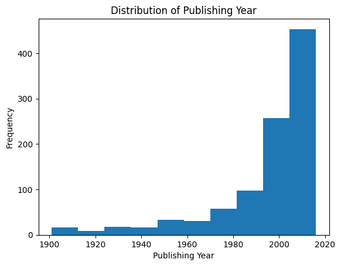

# 📊 Book Sales Data Analysis

## 📌 Overview
This project performs Exploratory Data Analysis (EDA) on a book sales dataset to uncover patterns in sales, ratings, and publisher performance.

## 📂 Dataset
The dataset contains:
- Book name, author, publisher
- Ratings and number of reviews
- Sales and revenue information

## 🔧 Tools Used
- Python
- Pandas
- Matplotlib / Seaborn

## 📊 Key Analysis
- Publisher-wise revenue analysis
- Author rating vs book ratings count
- Sales distribution across books
- Trend analysis of publishing year

## 📈 Key Insights
- Top publishers contribute significantly to total revenue
- Books with higher author ratings tend to have higher engagement
- Sales are unevenly distributed across categories

## 📸 Sample Visualizations

## ▶️ How to Run
1. Clone this repository
2. Install dependencies:
   pip install -r requirements.txt
3. Open notebook and run all cells